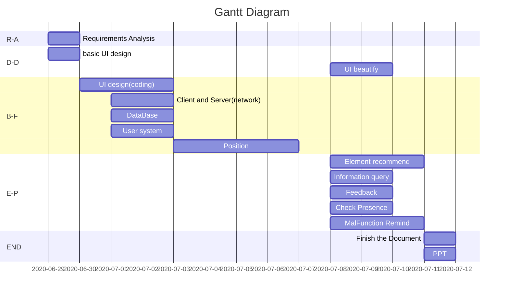

# Requirement analysis

----------------

## Version info
```!
Version 1.0
Updating date: 2020-07-02
Updated person: ZQK
Updated things: First edition
```

------------

## Document description


---------------

## Background / Software description

Product positioning: This product is a modern, functional app that provides users with services such as indoor map display, indoor destination navigation, location detailed information query, fault reminder, and absence judgment in class.
Product features: The product has a beautiful interface and is easy to use. In addition to the basic positioning and navigation and information query functions, it also provides users with special services such as fault reminders and class registration to meet the needs of users.
User needs: There are many classrooms and other places in the teaching building, and the information in the classroom is unknown. Students need an app that can quickly navigate to the destination and obtain detailed classroom information to save time and achieve results; for teachers, provide teachers with judgment students The service of whether to attend class or leave the classroom halfway, to meet the teacher's need to obtain student information.

产品定位：该产品是面向广大学生、教师，可为用户提供室内地图展示、室内目的地导航、地点详细信息查询、故障提醒、课上缺席判断等服务的一款现代型、功能型app。
产品特色：该产品界面美观、使用方便，除了基础的定位导航、信息查询功能外，还为用户提供故障提醒、上课签到等特色服务，满足用户多方面需求。
用户需求：教学楼内教室等地点较多，且教室内信息未知，学生需要一款可快速导航去目的地和获取教室详细信息的app以节约时间、达到效果；面向老师，为老师提供判断学生是否上课、中途离开教室的服务，满足老师的获取学生信息需求。

---------

## Structure of the software


-------------

## Detailed function description

### Basic functions
1. UI design
2. User system
3. Position
4. Network

### Extra functions
1. Element recommend
>> Regarding element recommend, the system will recommend some elements near the user, such as cafes, shops, study rooms, computer rooms, etc.
2. Location information query

>>For location information query, we provide a series of location information query for each classroom, teaching building, cafe, etc. Location information includes location information and navigation route, pictures of the place (uploaded by the user or brought by the system), comments on the place Wait.
3. Feedbacks

>>User feedback on the location, for example, the classroom is sunny and the room is dim, or there is no outlet or outlet in a classroom. Drinks in this cafe are very good, but the boss has a bad service attitude
In order to give users more opportunities for reference and vomiting

5. Malfunction remind

>>Failure repair, this function can provide better repair service for teachers and students in the school. After clicking to report the current location, the system will automatically read the current location (as long as it is within the coverage of the campus network), and notify the nearby staff to deal with it.

7. Check presenece in class
>>The classroom sign-in system can be considered for docking with the school student management information system to achieve classroom attendance. The system can record when and where the student stays, how long he stays, after importing the student schedule and real-time leave, we can use this to record whether the student is late, leaving early, or absent from class


---------------

## Non-functional requirements
1.performance requirements:
>>Response time: divided into daily interaction class, daily query class. The daily interaction has the system to provide the peripheral recommendation for the user automatically, the classroom comment and so on, the daily interaction class business has the higher response request. Query business such as study room inquiries, around the location inquiries, classroom check-in inquiries and so on. Because the query business is affected by the complexity of the query, the size of the query data and other factors, it needs to be determined according to the specific situation, and give a reference range. Response time indicators include: average response time reference (seconds), peak response time reference (seconds).
 Number of users: Number of users to consider the increase in the number of users long case, there are the following indicators: total number of users, peak online users, peak concurrent users, average online users, average concurrent users.
 throughput: estimation of system query volume. The indicators are positioning success (pen/year), peak evaluation (days/day).
 Data storage: Annual data storage capacity (G) and the expected (growth) value of that amount in the coming years. Indicators include cumulative storage capacity (G), annual growth (G).
 1.性能需求：
响应时间：分日常交互类、日常查询类。日常交互有系统自动为用户提供周边推荐，教室点评等，日常交互类业务具有较高的响应要求。 查询类业务如自习室查询、周围地点查询，课堂签到查询等。查询业务由于受到查询的复杂程度、查询的数据量大小等因素的影响，需要根据具体情况而定，给出一个参考范围。响应时间指标包括：平均响应时间参考值(秒)、峰值响应时间参考值（秒）。
用户数：用户数要考虑用户数的增长情况，有以下指标：总用户数、峰值在线用户数、峰值并发用户数、平均在线用户数、平均并发用户数。
吞吐量：系统查询量的估算。指标有定位成功（笔/年）、高峰期评价（个/天）。
数据存储量：每年的数据存储容量（G）及未来几年该数量的预期（增长）值。指标包括累计存储容量（G）、年增长（G）。

2. system reliability:
>>Positioning operations should be available during all working days from Monday to Sunday; other operations should meet 7×24 small Android4.0 above
 2.系统可靠性：定位业务应在从星期一到星期日的所有工作日的工作时间是可以使用的；其它业务应满足7×24小时可以使用；Android4.0以上
3. scalability:
 >>load balancing can be achieved; if the amount of information in the future, the system can increase the server to achieve expansion. The interface is humanized and the operation is easier.
3.可扩展性：可实现负载均衡；日后若信息量较大，则系统可相应增加服务器实现扩展。界面人性化，操作更简易。


-----------------

## Plan of the Project
### Flow of the task
#### Time schedule

- [x] 1. Requirement analysis
- [x] 2. basic UI design
- [ ] 3. UI beautify
- [ ] 4. UI design(coding)
- [x] 5. Client and Server(network)
- [ ] 6. DataBase
- [ ] 7. Position
- [ ] 8. Element recommend
- [ ] 9. Information query
- [ ] 10. Feedback
- [ ] 11. Check Presence
- [ ] 12. MalFunction Remind
- [ ] 13. PPT
- [ ] 14. Document

|In short|Meaning|
|-|-|
|R-A|Requirements Analysis|
|D-D|Demo Design|
|B-F|Basic Function|
|E-P|Extra Part|
|END|end of the task(including the file and ppt)|

---------------

#### version 
- v1.0 Basic Function complete
- v2.0 All extra part
> continue updating

----------------------------

### Distribute
|Work|Manager|Task Explain|
|-|-|-|
|Requirement analysis|LiuJiaXu||
||||
|Basic UI design|Liujiaxu|using modao|
|UI beautify|Liujiaxu|coding|
|UI design(coding)|Liujiaxu|coding|
|Client and Server(network)|Zhangfu||
|Position|ZQK||
||||
|Element recommend|huanglin||
|Information query|helanlan||
|Feedback|Zhangfu||
|Check Presence|ZQK||
|MalFunction Remind|Hemaoxin||
||||
|PPT|huanglin||
|Document|ZQK||
>Manager is the man who manage the corresponding part, not the one who is going to write the whole code, but the one who is going to be the leader to lead the team to complete the task.
----------------------------
------------------

## Appendix
