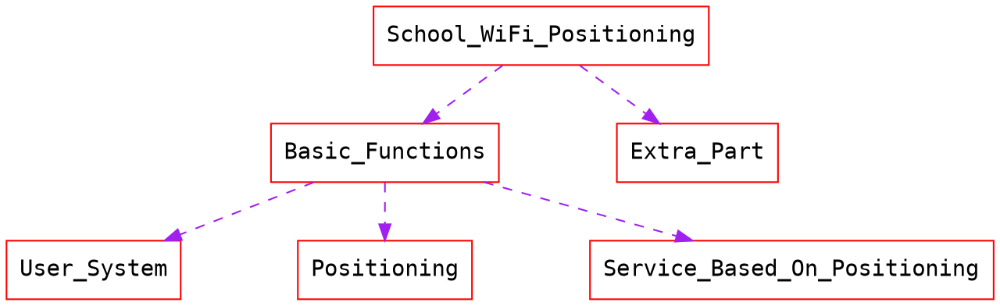
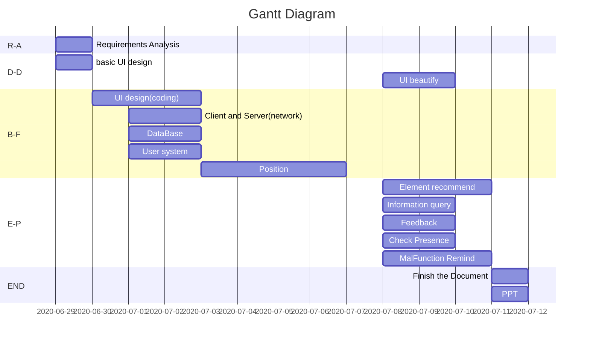

# Outline of School WiFi Positioning
## Structure of the project

## flow of the task

- [x] 1. Requirement analysis
- [ ] 2. basic UI design
- [ ] 3. UI beautify
- [ ] 4. UI design(coding)
- [ ] 5. Client and Server(network)
- [ ] 6. DataBase
- [ ] 7. Position
- [ ] 8. Element recommend
- [ ] 9. Information query
- [ ] 10. Feedback
- [ ] 11. Check Presence
- [ ] 12. MalFunction Remind
- [ ] 13. PPT
- [ ] 14. Document

|In short|Meaning|
|-|-|
|R-A|Requirements Analysis|
|D-D|Demo Design|
|B-F|Basic Function|
|E-P|Extra Part|
|END|end of the task(including the file and ppt)|

----------------------------

## basic functions
1. UI design
2. User system
3. Position
4. Network

## extra functions
1. Element recommend
2. Location information query
3. Recent feedbacks and all feedbacks
4. Malfunction remind
5. Check presenece in class

----------------------------

## distribute
|Work|Manager|Task Explain|
|-|-|-|
|Requirement analysis|LiuJiaXu||
||||
|Basic UI design|Liujiaxu|Using modao|
|UI beautify|Liujiaxu|using modao|
|UI design(coding)|Liujiaxu||
|Client and Server(network)|Zhangfu||
|Position|ZQK||
||||
|Element recommend|huanglin||
|Information query|helanlan||
|Feedback|Zhangfu||
|Check Presence|ZQK||
|MalFunction Remind|Hemaoxin||
||||
|PPT|huanglin||
|Document|ZQK||

----------------------------
