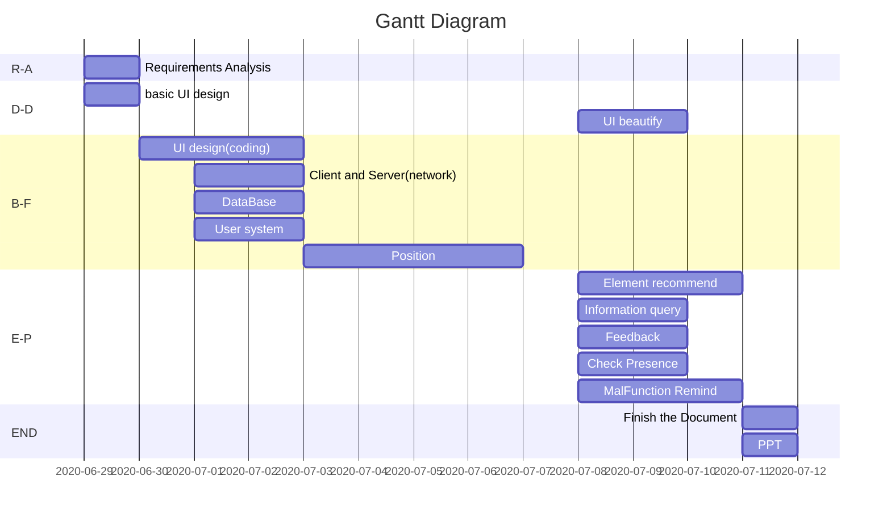

# WIFI Positioning
- [x] Install JAVA environment
- [x] Install Android studio
- [x] Run a HELLO WORLD

## flow of the task

- [ ] 1. Requirement analysis
- [ ] 2. basic UI design
- [ ] 3. UI beautify
- [ ] 4. UI design(coding)
- [ ] 5. Client and Server(network)
- [ ] 6. DataBase
- [ ] 7. Position
- [ ] 8. Element recommend
- [ ] 9. Information query
- [ ] 10. Feedback
- [ ] 11. Check Presence
- [ ] 12. MalFunction Remind
- [ ] 13. PPT
- [ ] 14. Document

|In short|Meaning|
|-|-|
|R-A|Requirements Analysis|
|D-D|Demo Design|
|B-F|Basic Function|
|E-P|Extra Part|
|END|end of the task(including the file and ppt)|

## Install steps
### Install java SDK
> https://www.runoob.com/java/java-environment-setup.html
### Install Android studio
> https://www.runoob.com/android/android-studio-install.html
## Build the first project
> https://developer.android.google.cn/training/basics/firstapp
### Install the AVD
1. Open AVD Manager

2. Create Virtual device

3. Select this device

4. Download a system image

5. Configuration Verify

6. Your Device is installed successfully

