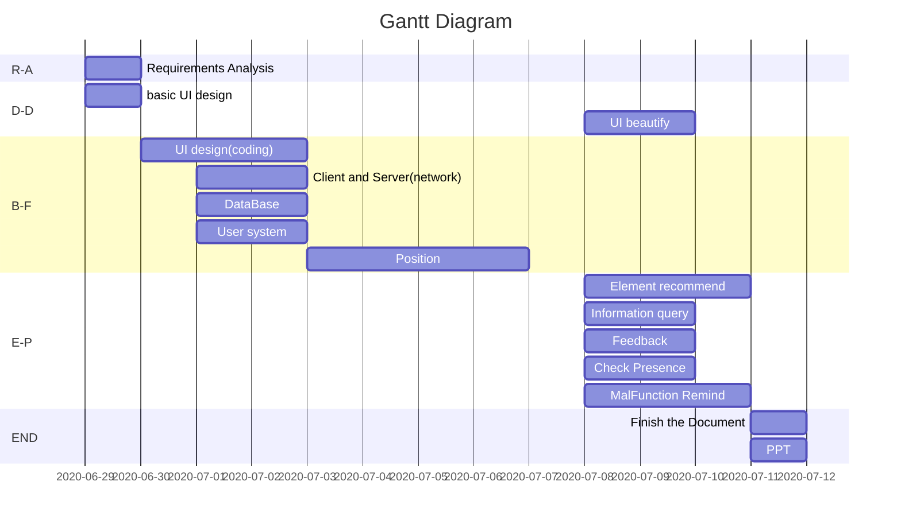

# Progress

1. 2020-07-01-16:00

| Name | Task | Explain |
| -------- | -------- | -------- |
| ZQK  |B-F-Positioning   | Wifi Scanning program (not finished)  |
|ZhangFu|B-F-Client&Server|not finished yet|
|LiuJiaXu|B-F-UIdesign|Almost Every pages' design|
|helanlan|B-F-client|modify client thread
|huanglin|B-F-client|modify client thread
|hemaoxin|B-F- server|modify server thread and learn KNN arithmetic

>This is the tabel shows that every pages corresponding relation

-------------------
-------------------

2. 2020-07-02-16:00

>Finished ppt, requirements analysis document, coding of UI connections, and learning KNN algorithm.

| Name | Task | Explain |
|-|-|-|
| ZQK  | B-F-Positioning   | Wifi Scanning program (finished),Combined with UI |
| ZhangFu | Server&DataBase |Test server and database(already right), write requirement document|
|LiuJiaXu|B-F-UIdesign|write requirement document，UI coding，improve UI demo|
|helanlan|B-F-client|write requirement document|
|huanglin|B-F-client|write requirement document，write first ppt（finshed）|
|heMaoXin|B-F-Server & Positioning|finish server code,learn KNN arithmetic|

>This is the tabel shows that every pages corresponding relation

>This is the UI that has finished

------------------
--------------

3. 2020-07-03-16:00

>application combining and learning KNN.

| Name | Task | Explain |
|-|-|-|
|Zhangfu|Client and ui|Combine with client and ui, finish network|
|ZQK|B-F-Positioning|Combie the wifiscan with our app|
|Liujiaxu|B-F-Positioning|Interface connectivity|
|huanglin|B-F-Positioning|learn some algorithm about Fingerprint location|

------------------
--------------

4.2020-07-04-16:00

> Continue to Finish the network part.
> We have finished the WIFISCAN part, and we are recording the position point information.
> We began to code the positioning part.

| Name | Task | Explain |
|-|-|-|
|Zahangfu|Client|Combine with client and ui|
|Liujiaxu|B-F-Positioning|Interface connectivity,Record the data of the poings|
|huanglin|B-F-Positioning|learn some KNN algorithm and how to process data|
|helanlan|B－F－learning|learning algorithm
|ZQK|B-F-Positioning|Finished the WIFISCAN part & record the point information|
